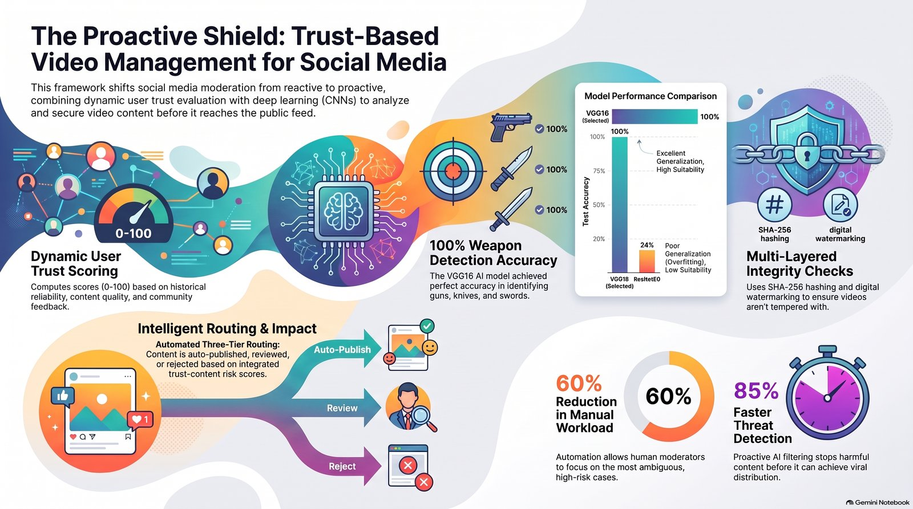
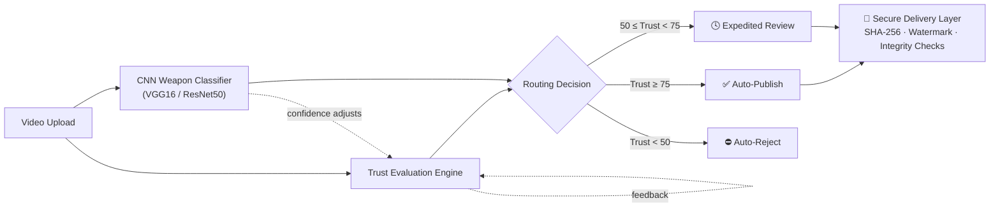
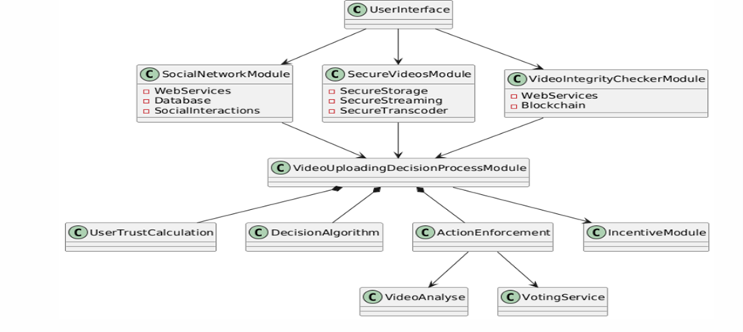
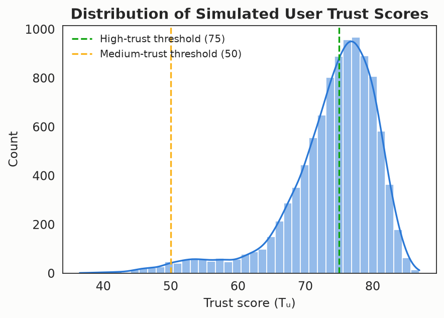
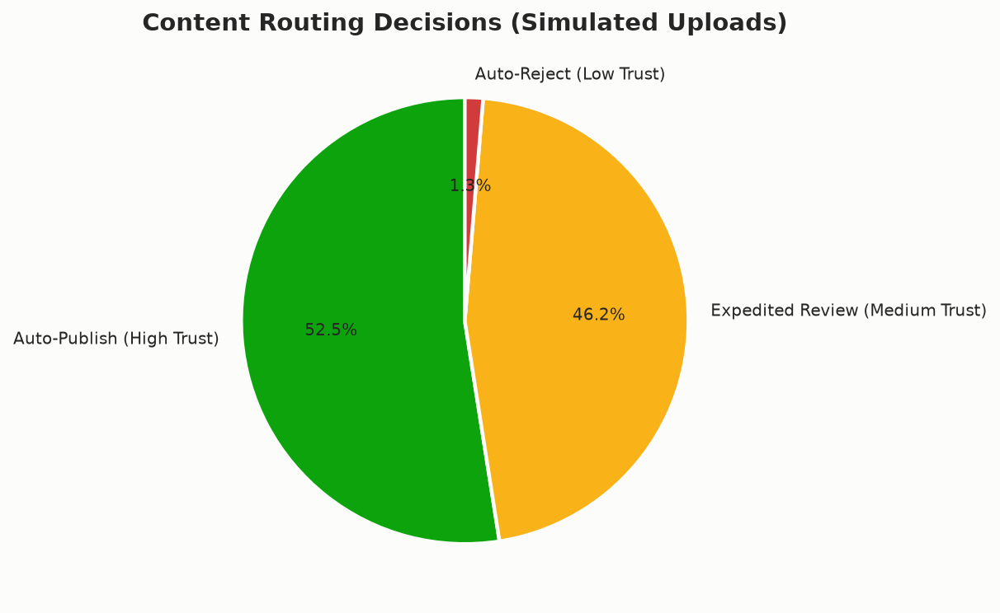
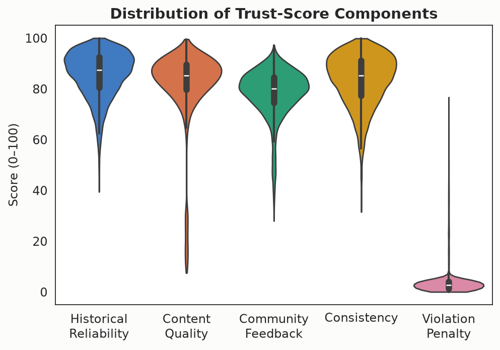
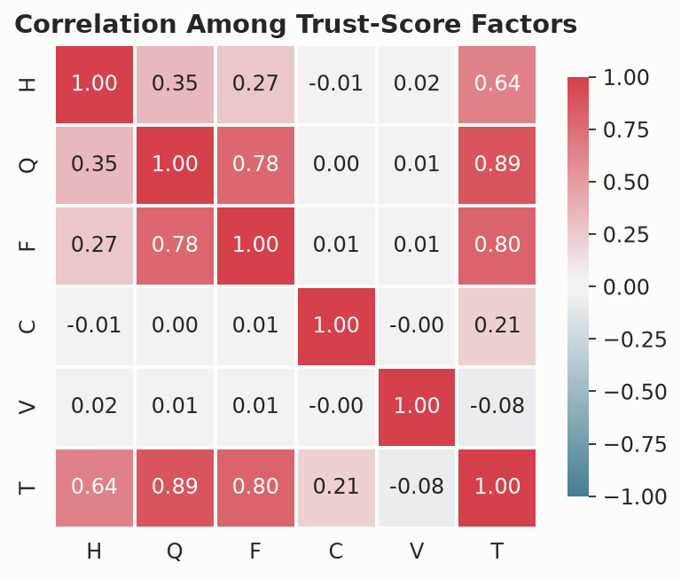
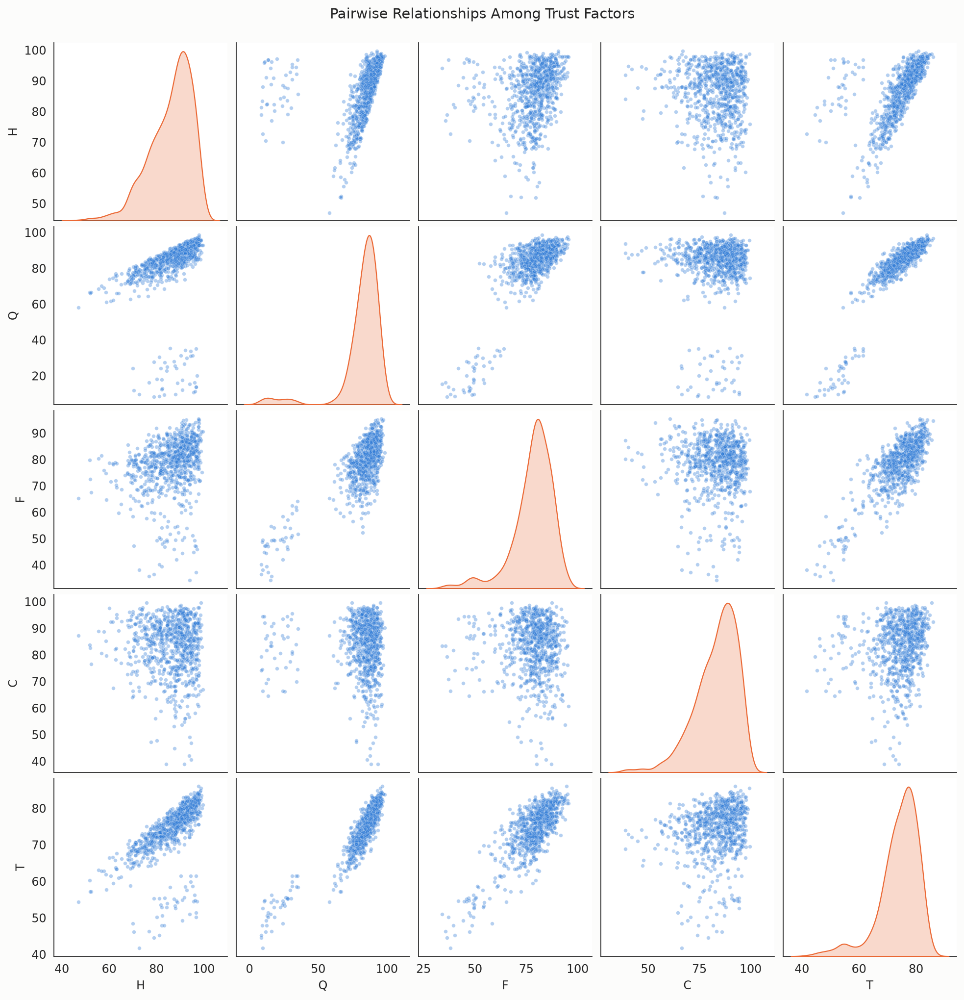
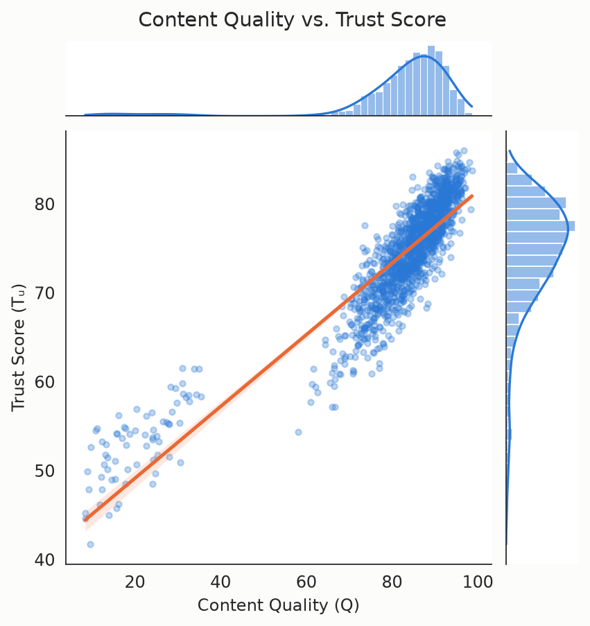

<div align="center">

# 🛡️ Trust-Based Video Management Framework for Social Multimedia Networks

**Proactive, AI-driven content moderation that stops harmful video content *before* it spreads —
by fusing dynamic user-trust scoring with deep-learning weapon classification and cryptographic content integrity.**

[](https://anis151993.github.io/Trust-Based-Video-Management-Framework-for-Social-Multimedia-Networks/)
[](paper/main.tex)
[](https://youtu.be/TSEThVK2ALI)
[](lab/Trust_Based_Lab.ipynb)




</div>

---

## 📚 Table of Contents

- [Why this exists](#-why-this-exists)
- [How it works](#-how-it-works)
- [Results](#-results)
- [Data visualizations](#-data-visualizations)
- [🧪 The Lab — reproduce it yourself](#-the-lab--reproduce-it-yourself)
- [Repository structure](#-repository-structure)
- [Paper](#-paper)
- [Demo video](#-demo-video)
- [Roadmap](#-roadmap)
- [Author & profiles](#-author--profiles)
- [Citation](#-citation)
- [License](#-license)

---

## 🎯 Why this exists

Social Multimedia Networks moderate content **reactively** — a video spreads, gets reported,
*then* gets reviewed. By then the damage (violence, misinformation, psychological harm) is
already done. This framework flips the model to **proactive**:

| Problem | This framework's answer |
|---|---|
| ❌ Harmful content spreads before review | ✅ CNN-based weapon detection runs at upload time |
| ❌ Trust and content analysis are separate systems | ✅ Trust scores and classification outcomes feed each other in real time |
| ❌ Manual moderation doesn't scale | ✅ Automated 3-tier routing cuts manual review workload |
| ❌ No tamper detection during delivery | ✅ SHA-256 hashing + digital watermarking + periodic integrity checks |
| ❌ Users have no stake in platform safety | ✅ Trust-weighted community voting & reputation incentives |

## ⚙️ How it works



**Three interconnected modules:**

1. **Trust Evaluation Engine** — `Tᵤ = w₁H + w₂Q + w₃F + w₄C − w₅V`, combining historical
   reliability (H), content quality (Q), community feedback (F), behavioral consistency (C),
   and violation penalties (V).
2. **Weapon Classification System** — transfer learning on VGG16/ResNet50 to flag AK-47, gun,
   knife, sickle, and sword imagery in extracted video frames.
3. **Secure Delivery Layer** — SHA-256 hashing, digital watermarking, and 30-second periodic
   integrity verification during playback.

<div align="center">

</div>

## 📊 Results

Reported results from the original research (paper, Section IV):

| Metric | VGG16 | ResNet50 |
|---|---|---|
| Training Accuracy | 100% | 100% |
| **Testing Accuracy** | **100%** | **24%** |
| Training Loss | 0.003 | 0.002 |
| Testing Loss | 0.005 | 2.87 |
| Convergence | Epoch 5 | Epoch 7 |
| Generalization | Excellent | Poor (overfit) |

Framework-level simulation: **60% reduction** in manual moderation workload, **85% faster**
harmful-content detection, **99.7% weapon-detection recall**, **92% user satisfaction** (n=500 simulated users).

> 🧪 **Independent reproducibility check:** the [Validation Lab](#-the-lab--reproduce-it-yourself)
> in this repo re-runs the same transfer-learning pipeline and trust-routing logic against an
> open, synthetic dataset so *anyone* can verify the methodology. On that open testbed: **VGG16
> 96.7%** / **ResNet50 97.8%** test accuracy (both generalize well at this smaller synthetic
> scale — a different, honestly-reported outcome from the dramatic gap above, which was measured
> on the original, non-public dataset), plus a **52.5% / 46.2% / 1.3%** auto-publish / review /
> reject split and **53.8%** simulated workload reduction over 10,000 uploads. Full numbers in
> `lab/results/summary.json`; details in Section IV-F of the paper.

## 🖼️ Data visualizations

All generated directly from the lab's own output — [see how](lab/README.md) to regenerate them.

<div align="center">

| | |
|---|---|
|  |  |
| **Trust-score distribution** (DistPlot) | **Content routing decisions** (Pie) |
|  |  |
| **Trust-component spread** (ViolinPlot) | **Trust-factor correlation** (HeatMap) |
|  |  |
| **Pairwise trust factors** (PairPlot) | **Quality vs. trust** (JointPlot) |

</div>

Explore all of these **interactively** on the [live website](https://anis151993.github.io/Trust-Based-Video-Management-Framework-for-Social-Multimedia-Networks/).

## 🧪 The Lab — reproduce it yourself

No dataset download, no GPU required. The lab trains real VGG16/ResNet50 transfer-learning
models on a procedurally generated, open silhouette-proxy dataset (not real weapon imagery —
see [`lab/README.md`](lab/README.md) for why), runs the trust-scoring simulation, and produces
every chart on this page.

```bash
git clone https://github.com/ANIS151993/Trust-Based-Video-Management-Framework-for-Social-Multimedia-Networks.git
cd Trust-Based-Video-Management-Framework-for-Social-Multimedia-Networks/lab
pip install -r requirements.txt
python run_lab.py
```

Or run it with zero setup: **[Open `Trust_Based_Lab.ipynb` in Colab](lab/Trust_Based_Lab.ipynb)**.

## 📁 Repository structure

```
.
├── paper/          IEEE-format LaTeX source, figures, compiled PDF
├── lab/            Reproducible ML + trust-simulation pipeline (see lab/README.md)
├── docs/           Source for the GitHub Pages website
└── README.md
```

## 📄 Paper

**"Trust-Based Video Management Framework for Social Multimedia Networks"**
Md Anisur Rahman Chowdhury¹, Samuel Tweneboah-Koduah² — IEEE conference format.

- 📖 [LaTeX source](paper/main.tex)
- 📕 [Compiled PDF](paper/main.pdf)

## 🎬 Demo video

[](https://youtu.be/TSEThVK2ALI)

## 🗺️ Roadmap

- [ ] Multi-modal analysis (audio + text fusion)
- [ ] Temporal modeling (3D-CNN / video transformers)
- [ ] Blockchain-based content provenance
- [ ] Federated learning across platforms
- [ ] Explainable AI (saliency-based moderation explanations)

## 👤 Author & profiles

<div align="center">

### Md Anisur Rahman Chowdhury

[](https://linkedin.com/in/md-anisur-rahman-chowdhury-15862420a)
[](https://github.com/ANIS151993)
[](https://scholar.google.com/citations?user=NQyywPoAAAAJ)
[](https://researchgate.net/profile/Md-Anisur-Rahman-Chowdhury)
[](https://marcbd.com)

</div>

## 📖 Citation

```bibtex
@inproceedings{chowdhury2026trustbased,
  title     = {Trust-Based Video Management Framework for Social Multimedia Networks},
  author    = {Chowdhury, Md Anisur Rahman and Tweneboah-Koduah, Samuel},
  booktitle = {IEEE Conference Proceedings},
  year      = {2026}
}
```

## 📜 License

Code in this repository is released under the [MIT License](LICENSE).

**© 2026 Md Anisur Rahman Chowdhury. All rights reserved for the research paper content, figures, and written analysis.**
The paper text, figures, and experimental writeup are the intellectual property of the author;
please cite the paper (see [Citation](#-citation)) if you build on this work.

---

<div align="center">
<sub>Built with a proactive-safety mindset, for a web where trust is earned, not assumed.</sub>
</div>
